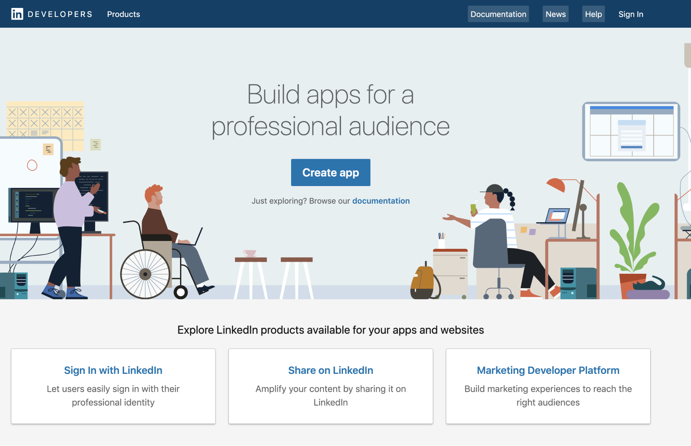
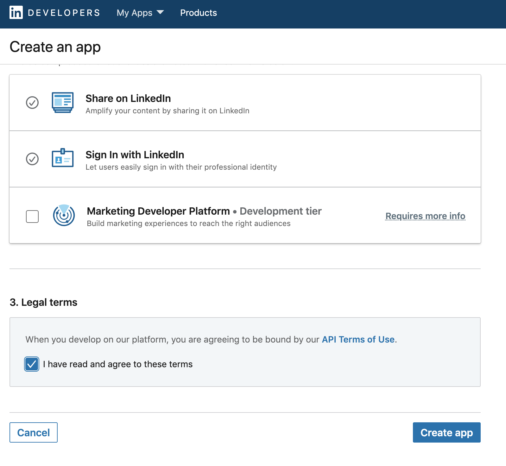

# LinkedIn

Cloudflare Access allows your users to use LinkedIn as their identity provider (IdP).

## Set up LinkedIn as an IdP

Configuring LinkedIn as a Cloudflare Access IdP requires a LinkedIn account.

To configure LinkedIn as an IdP:

1. Go to [the LinkedIn Developer Portal](https://www.linkedin.com/developers).

1. Click **Create App**.

   

1. Sign in to your LinkedIn account. The **Create an app** screen displays.

   

1. Enter an **App name** for your application.

1. Enter the URL for your business page.

1. Click **Upload a logo** and navigate to your company logo image file.

1. Click **OK**.

1. (optional) Select the **Share on LinkedIn** option to announce that your clients can use LinkedIn to access your app.

   

1. Select the **Sign In with LinkedIn** option.

1. Click the **API Terms of Use** link to read the terms of use.

1. If you agree to the terms, check the **I have read and agree to these terms** option.

1. Click **Create app**.

1. Go to your account Settings page.

   

1. Click the **Auth** tab.

1. Copy the **Client ID** and **Client Secret**.

1. On the Teams dashboard, navigate to **Settings > Authentication**.

1. Under **Login methods**, click **Add new**.

1. Select **LinkedIn** as your IdP.

1. In the **App ID** and **Client secret** fields, input the **Client ID** and **Client secret** values you've copied from the Application credentials tab in the LinkedIn Developer Portal.

1. Click **Save**.

1. In the **LinkedIn** **Auth** tab, scroll to **OAuth 2.0 settings** and click the **pencil icon** to edit the settings.

   

1. Enter your [team domain](/glossary#team-domain) followed by this callback at the end of the path: `/cdn-cgi/access/callback`. For example:

   ```txt
   https://<your-team-name>.cloudflareaccess.com/cdn-cgi/access/callback
   ```

To test that your connection is working, in the Teams dashboard, navigate to **Authentication > Login methods** and click **Test** next to LinkedIn.

## Example API configuration

```json
{
  "config": {
    "client_id": "<your client id>",
    "client_secret": "<your client secret>"
  },
  "type": "linkedin",
  "name": "my example idp"
}
```
