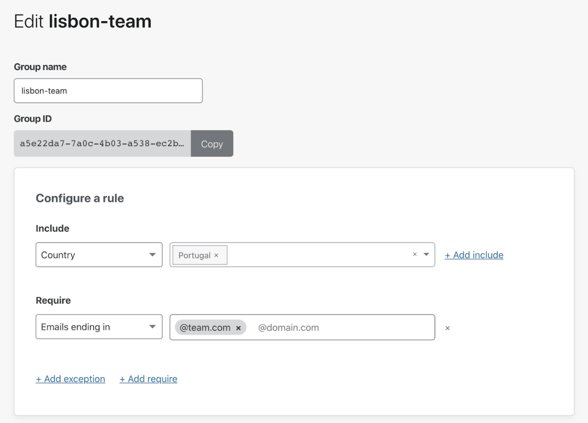
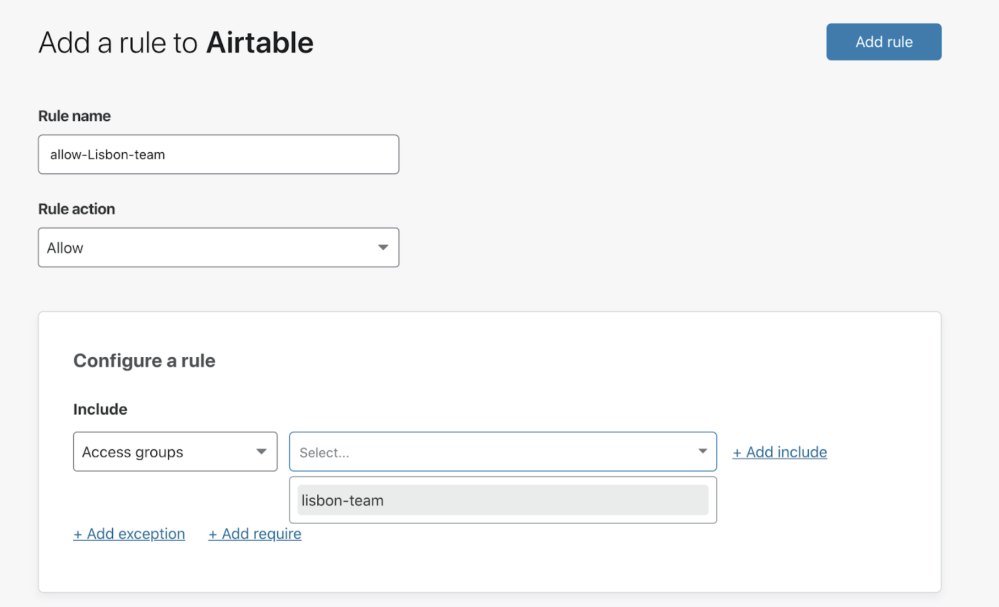
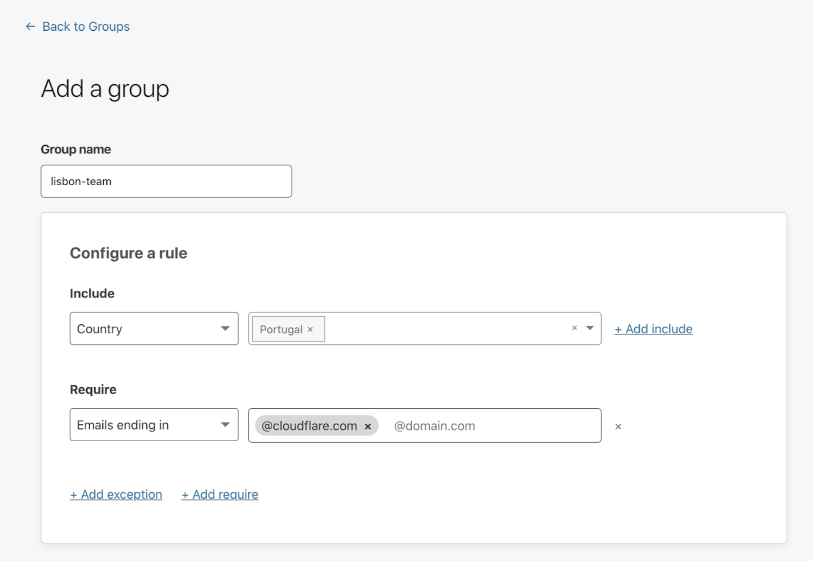

# Access groups

## Definition

A group is a set of rules that can be configured once and then quickly applied across many Access applications. You can select a group as a selector in any Zero Trust policy, and all the criteria from the selected group will apply to that application.

<Aside type="note">

Access groups are distinct from groups in your identity provider, like Okta groups. Access groups can contain a mix of individual users, groups from identity providers, and service authentication options like service tokens.

</Aside>

## Example scenario

Imagine you want to grant access to your applications to your team based in Lisbon, Portugal. In order to avoid building the same set of rules over and over across your applications, you can create a group called `lisbon-team`, which comprises:

- an Include rule granting access to everyone in Portugal, and
- a Require rule restricting access to users whose email ends in `@team.com`.

Once the group is set up, you can use it to configure rules within your applications as follows:

## Create a group

To create and manage groups:

1. On the [Teams dashboard](https://dash.teams.cloudflare.com), navigate to the **My Teams** section.
1. Open the Groups tab.
1. Click **Add a Group**.
1. Enter a name for the group.
1. Specify as many rules as needed to define your user group.

6. Click **Save**.

## Group criteria

Group criteria determine whether or not a user is a member of a particular group.

Groups follow the same [logic](/policies/) as rules for Zero Trust policies in Access.

Group criteria help define whether to include or exclude a team member from a group. Here is a list of criteria and examples:

- **Emails** — `you@company.com`
- **Emails ending in** — `@company.com`
- **Access groups** — `example-team`
- **IP ranges** — `192.168.100.14` (supports IPv4 and IPv6)
- **Everyone** — allows, denies, or bypasses access to everyone.
- **Country** – uses the IP address to determine country
- **Valid Certificate** - The request will need to present any valid client certificate
- **Common Name** - The request will need to present a valid certificate with an expected common name
- **Any Access Service Token** - The request will need to present the headers for any service token created for this account
- **Service Token** - The request will need to present the correct service token headers configured for the specific application
- **Identity provider groups** — Employs the user groups (if supported) you configured with your identity provider (IdP) or LDAP with Access. The IdP group option only displays if you use an identity provider that passes groups using SAML or OAuth Scope.

## Using groups for IP-based rules

We recommend using groups to define any IP address-based rules you configure in policies. Keeping IP addresses in one place allows you to modify or remove addresses once, rather than in each policy, and reduces the potential for mistakes.

<Aside>

If adding more than one IP address or range to a group, it’s best to use an Include rule. If you don’t use the Include rule, the policy using that group attempts to require traffic to originate from all ranges.

</Aside>

## Using groups for country requirements

You can create an Access Group that consists of countries to allow or block. The Access Group will treat the countries in the `Include` policy with an `OR` operator. You can use this Access Group inside of a `Require` rule to require at least one of the countries inside of the group.
