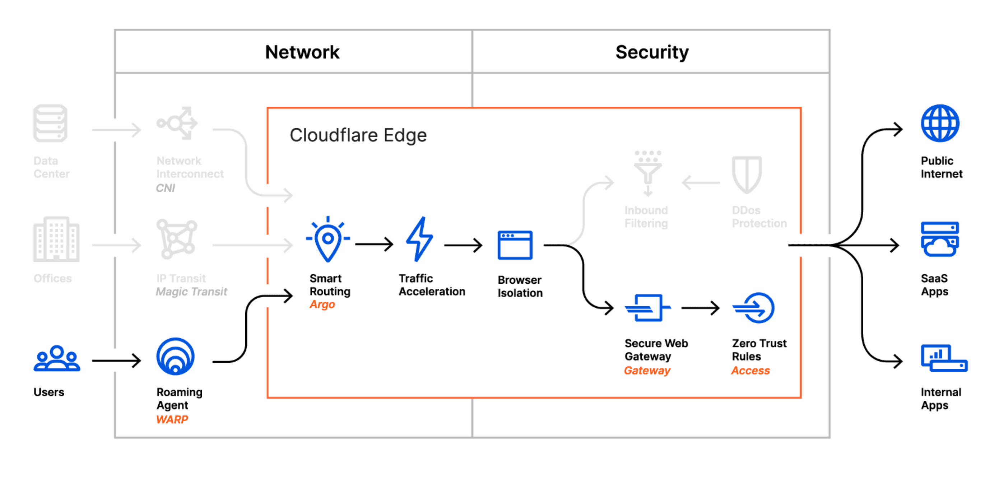

# Browser Isolation

<bongo:aside type="note">

Browser Isolation is available as an add-on to Teams Standard and Enterprise plans. See our [payment plans](https://www.cloudflare.com/teams-pricing/) for more information.

</bongo:aside>

Cloudflare Browser Isolation complements the Teams Secure Web Gateway and Zero Trust Network Access solutions by executing active webpage content in a secure isolated browser. Executing active content remotely from the endpoint protects users from zero-day attacks and malware. In addition to protecting endpoints, Browser Isolation also protects users from phishing attacks by preventing user input on risky websites and controlling data transmission to sensitive web applications.

Remote browsing is invisible to the user who continues to use their browser normally without changing their preferred browser and habits. Every open tab and window is automatically isolated.

Just like Gateway allows you to define policies to filter traffic based on content categories or security threats, with Browser Isolation you can define policies to dynamically isolate websites based on identity, security threats, or content. To build Browser Isolation policies, navigate to **Policies** > **HTTP policies** on the Teams Dashboard. In the rule builder, choose the _Isolate_ or _Do not Isolate_ actions to enable or disable isolation for certain websites or content.

## Prerequisites

To start protecting your users through remote browsing, you need:

- A Cloudflare for Teams Standard or Enterprise plan, and a Browser Isolation add-on subscription
- The [WARP client](/connections/connect-devices/warp) installed on your devices

## Isolate policies

When an HTTP policy applies the Isolate action, the user's web browser is transparently served an HTML compatible remote browser client. Isolation policies can be applied to requests that include `Accept: text/html*`. This allows Browser Isolation policies to co-exist with API traffic.

If you'd like to isolate **all security threats**, you can set up a policy with the following configuration:

| Selector         | Operator | Value                | Action  |
| ---------------- | -------- | -------------------- | ------- |
| Security Threats | In       | All security threats | Isolate |

If instead you need to isolate **specific hostnames**, you can list the domains you'd like to isolate traffic to:

| Selector | Operator | Value                        | Action  |
| -------- | -------- | ---------------------------- | ------- |
| Host     | In       | `example.com`, `example.net` | Isolate |

<bongo:aside type='note' header='Isolate identity providers for applications'>

Existing cookies and sessions from non-isolated browsing are not sent to the remote browser. Websites that implement single sign on using third-party cookies will also need to be isolated.

For example, if `example.com` authenticates using Google Workspace, you will also need to isolate the top level <a href="https://support.google.com/a/answer/9012184">Google Workspace URLs</a>.

</bongo:aside>

## Do Not Isolate policies

You can choose to disable isolation for certain destinations or categories. The following configuration disables isolation for traffic directed to `example.com`:

| Selector | Operator | Value         | Action         |
| -------- | -------- | ------------- | -------------- |
| Host     | In       | `example.com` | Do Not Isolate |

## Settings

Malware and zero-day threats are not the only security challenges administrators face with web browsers. The mass adoption of SaaS products has made the web browser the primary tool used to access data. Lack of control over both the application and the browser has left administrators little control over their data once it is delivered to an endpoint.

All the following settings can be applied to websites through Applications, Lists, Domain and Hostname expressions.

### Disable copy / paste

- **Behavior**. Prohibits users from copying and pasting content between a remote web page and their local machine.
- **Use Case**. [Protect sensitive content in self-hosted or SaaS applications from data loss](https://blog.cloudflare.com/data-protection-browser/).

### Disable printing

- **Behavior**. Prohibits users from printing remote web pages to their local machine.
- **Use Case**. [Protect sensitive content in self-hosted or SaaS applications from data loss](https://blog.cloudflare.com/data-protection-browser/).

### Disable keyboard

<Aside>
  Mouse input remains available (to allow users to navigate a website by following hyperlinks and
  scrolling). This does not prevent user input into third party virtual keyboards within a remote
  webpage.
</bongo:aside>

- **Behavior**. Prohibits users from performing keyboard input into the remote page.
- **Use Case**. Prevent users inputting sensitive information into unknown/untrusted websites.

### Disable upload

<Aside>
  This option does not prevent files being uploaded to websites from third party cloud file managers
  or files downloaded into the remote browser download bar from other isolated websites. To prevent
  files being uploaded from the remote browser into an isolated website use HTTP Policies to block
  by Upload Mime Type.
</bongo:aside>

- **Behavior**. Prohibits users from uploading files from their local machine into a remote web page.
- **Use Case**. Protect sensitive data from being exfiltrated to unknown/untrusted websites.

### Disable download

<Aside>
  This option does not prevent files from being downloaded into the remote browser. To prevent files
  being downloaded into the remote browser use HTTP Policies to block by Download Mime Type.
</bongo:aside>

- **Behavior**. Prohibits users from exporting files from the remote browser to their local machine.
- **Use Cases**. Protect users from downloading files from unknown/untrusted sources, and protect sensitive content in self-hosted or SaaS applications from data loss.

## Privacy

Cloudflare Browser Isolation is a security product. In order to serve transparent isolated browsing and block web based threats our network decrypts Internet traffic using the [Cloudflare Root CA](/connections/connect-devices/warp/install-cloudflare-cert). Traffic logs are retained as per the [Gateway Logs](/analytics/gateway) documentation.
