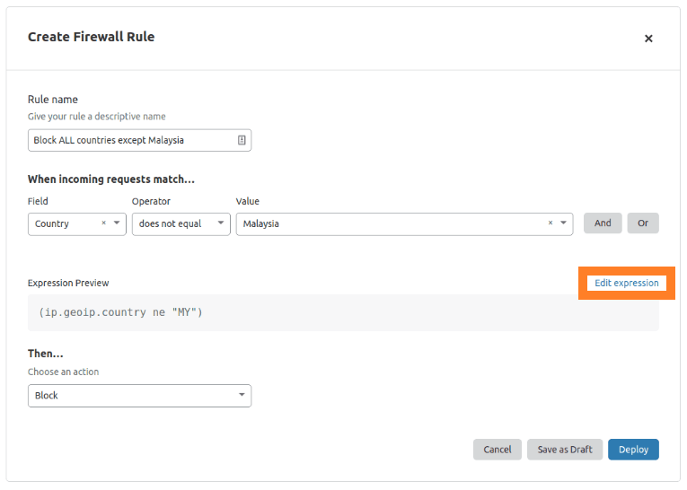
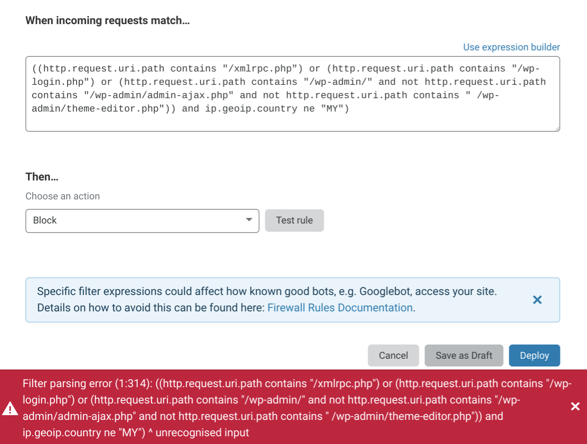

# Edit rule expressions

## Overview

The **Expression Editor** is a text-only interface for creating Firewall Rules expressions. Although it lacks the visual simplicity of the Expression Builder, the Expression Editor supports the entire specification of Cloudflare's Firewall Rules Language.

For example, only the Expression Editor supports grouping symbols. Cloudflare designed the Firewall Rules Language with [Wireshark Display Filters®](https://www.wireshark.org/docs/wsug_html_chunked/ChWorkBuildDisplayFilterSection.html) in mind, so although there are some subtle differences, Wireshark users should feel right at home with Firewall Rules and be able to easily port their existing rules to Cloudflare.

<bongo:aside type='warning' header='Important'>

Firewall Rules expressions have a 4 KB limit. This is approximately 4,000 text characters. This limit applies whether you use the visual **Expression Builder** or edit your expression manually in the **Expression Editor**.

</bongo:aside>

## Use the Expression Editor

The Expression Editor is located in the **Create Firewall Rule** and **Edit Firewall Rule** panels. The editor supports all available Firewall Rules fields, operators, and transformation functions. It also supports parentheses as grouping symbols.

To edit an expression in the editor:

1. In the **Firewall Rules** tab, use the **Create a Firewall rule** button to create a new rule, or click the **wrench** icon to edit an existing rule.

   

   The **Create Firewall Rule** page displays.

1. To switch to the Expression Editor in the **Create Firewall Rule** page, click **Edit expression**.

   

1. Use the text input to edit your expression. To commit your changes, click **Deploy** or **Save as draft**.

To switch from the editor to the Expression Builder, click **Use expression builder**.

In general, you can switch back and forth between the Expression Builder and the Expression Editor. However, if you use parentheses to nest expressions in the editor, you will not be able to switch to the Expression Builder, because the builder does not support nested expressions.

## Create nested expressions

A key advantage of the Expression Editor is support for parentheses as [grouping symbols](/cf-firewall-language/operators/#grouping-symbols), which allow you to explicitly group and nest expressions and, in turn, create highly targeted expressions.

This example a rule that challenges any visitor who is not from Malaysia and tries to access WordPress URI paths.

Only the Expression Editor supports nested expressions such as the one above. If you create a rule with nested expressions in the Expression Editor and try to switch to the Expression Builder, a dialog will warn you that the expression is not supported in the builder. You will be prompted to **Discard changes** and switch to the Expression Builder or **Cancel** and continue working in the editor.

Cloudflare validates all expressions before saving them, so if your expression is malformed, you will receive an error message, as shown in this screenshot:

The Expression Editor supports the entire Firewall Rules Language. For a complete listing of supported fields and operators, as well as guidance on using grouping symbols, see [_Firewall Rules language_](/cf-firewall-language).
