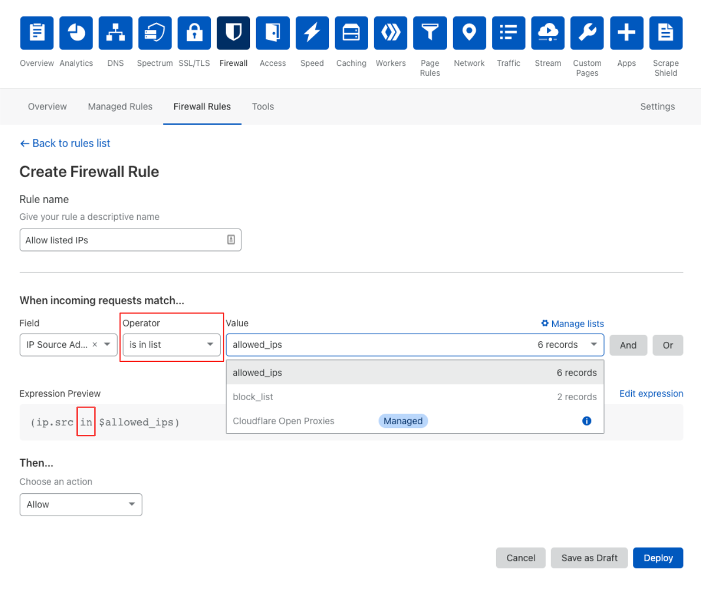

# Use lists in expressions

## Expression Builder

To use a Rules List in the [Expression Builder](/cf-dashboard/create-edit-delete-rules/):

1. Select _is in list_ or _is not in list_ from the **Operator** drop-down list.

   

1. Select a Rules List from the **Value** drop-down list.

1. When you are done composing your rule, click **Deploy** to commit your changes and enable your rule. Click **Save as draft** if you are not ready to enable the rule.

## Expression Editor

To use a Rules List in the [Expression Editor](/cf-dashboard/expression-preview-editor) specify the `in` operator and use _\$<list_name>_ to specify the name of the list.

This expression filters requests from IP addresses that are in a Rules List named _office_network_:

```sql
ip.src in $office_network;
```

Note that names for Rules Lists can only include lowercase letters, numbers, and the underscore (`_`) character.

For more on creating lists, see [_Use Rules Lists: Manage lists_](/cf-dashboard/rules-lists/manage-lists).

To create a new rule via API using the Cloudflare Open Proxies Managed List use the following expression:

`(ip.src in $cf.open_proxies)`

<bongo:aside type='warning' header='Important'>
Access to the Open Proxy List requires a Cloudflare Enterprise plan.
</bongo:aside>
