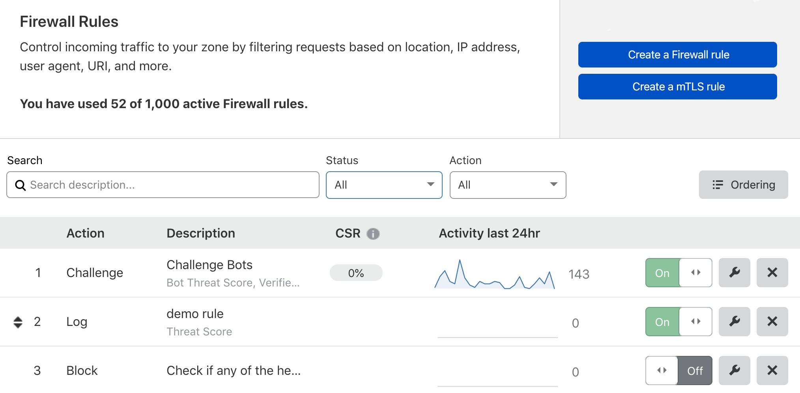
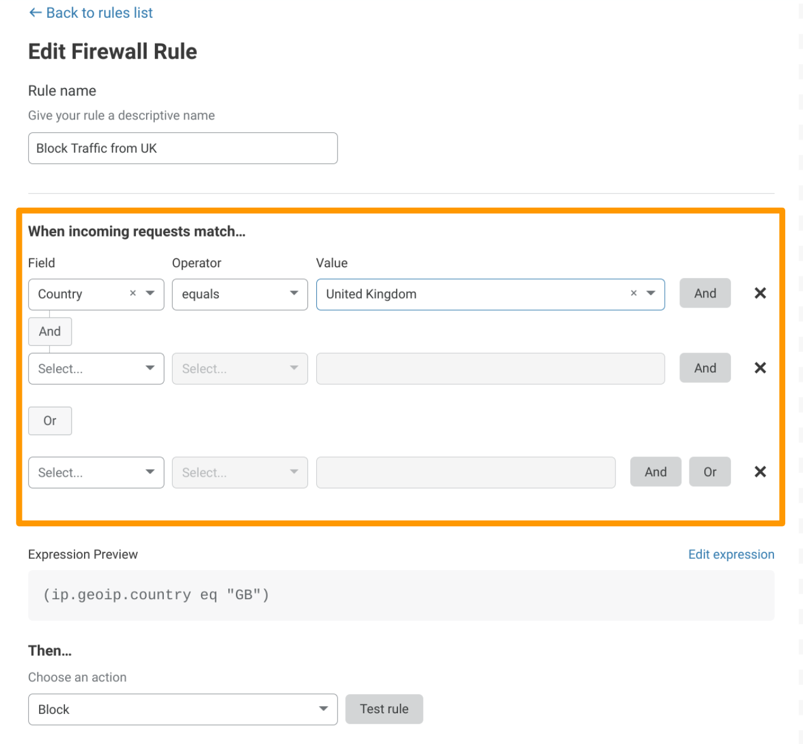
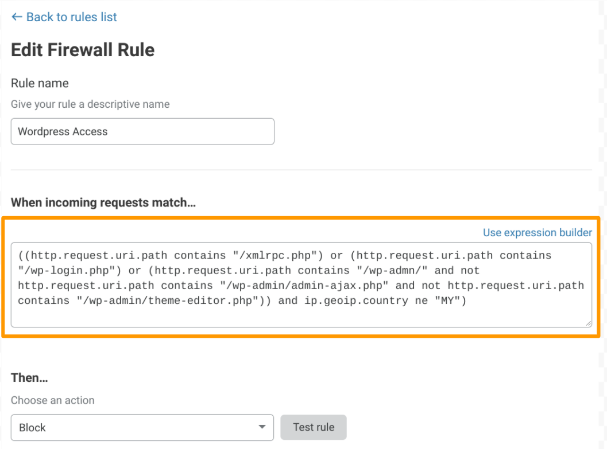

# About Cloudflare Firewall Rules

## Flexibility and control

**Cloudflare Firewall Rules** is a flexible and intuitive framework for filtering HTTP requests. It gives you fine-grained control over which requests reach your applications.

Firewall Rules complements existing Cloudflare tools by allowing you to create rules that combine a variety of techniques. For example, rather than managing 3 independent rules in 3 different places, you can easily create a single firewall rule that blocks traffic to a URI when the request comes from a particular IP and the user-agent matches a specific string or a pattern. Once you are satisfied with the rule, you can deploy it yourself, immediately.

Fundamentally, Firewall Rules gives you the power to proactively inspect incoming site traffic and automatically respond to threats. You define **expressions** that tell Cloudflare what to look for and specify the appropriate **action** to take when those criteria are satisfied.

It is a simple concept, but like the Wireshark Display Filter language that inspired our own expression language, the Firewall Rules language is a powerful tool that allows organizations to rapidly adapt to a constantly evolving threat landscape.

## Working with Firewall Rules

To configure Firewall Rules from the Cloudflare dashboard, use the **Firewall Rules** tab in the **Firewall** app. For more, see [_Manage rules in the Cloudflare dashboard_](/cf-dashboard).

To configure Firewall Rules with the Cloudflare API, use the Firewall Rules API. Use the Cloudflare Filters API to manage expressions. For more, see [_Manage rules via the APIs_](/api).

You can also manage Firewall Rules through Terraform. For more, see [_Getting Started with Terraform_](https://blog.cloudflare.com/getting-started-with-terraform-and-cloudflare-part-1/).

### Firewall Rules tab

The **Rules List** gives you a snapshot of recent activity and allows you to manage firewall rules in a single convenient location (see image below).

#### Challenge Solve Rate (CSR)

The **Rules List** displays each rule's **CSR** (Challenge Solve Rate), which is the percentage of issued challenges that were solved. This metric applies to rules configured with _Challenge (Captcha)_ or _JS Challenge_ actions, and it is calculated as follows:

  <var>CSR</var> = <var>number of challenges solved</var> / <var>number of challenges issued</var>

Hover over the CSR to reveal the number of issued and solved CAPTCHA challenges:

A low CSR means that Cloudflare is issuing a low number of CAPTCHA challenges to actual humans, since these are the solved challenges.

You should aim for a low Challenge Solve Rate. Review the CSR of your CAPTCHA rules periodically and adjust them if necessary:

- If the rate is higher than expected, for example regarding a Bot Management rule, consider relaxing the rule criteria so that you issue fewer challenges to human visitors.
- If the rate is 0%, no CAPTCHA challenges are being solved. This means that you have no human visitors whose requests match the rule filter. Consider changing the rule action to _Block_.

<Aside type="warning" header="Important">

Currently, Cloudflare does not calculate the CSR of Managed Challenges.

For customers on a Free plan, any rules configured with the _Challenge (Captcha)_ action now use Managed Challenges. For more information, see [Understanding Cloudflare Captchas and Challenge Passage](https://support.cloudflare.com/hc/articles/200170136#managed-challenge).

</Aside>

### Expression Builder

Both the **Create Firewall** and **Edit Firewall** panels include the visual **Expression Builder** (outlined below, in orange), which is an excellent tool to start with.

### Expression Editor

Advanced users will appreciate the **Expression Editor** (shown below), which trades the visual simplicity of the builder for the raw power of the [Cloudflare Firewall Rules language](https://developers.cloudflare.com/firewall/cf-firewall-language). The editor also supports advanced features, such as grouping symbols, for constructing highly sophisticated, targeted rules.

### Firewall Rules APIs

Power users, particularly those who develop large numbers of firewall rules, can use the Cloudflare API to programmatically manage Firewall Rules (see [_Manage rules via the API_](https://developers.cloudflare.com/firewall/api)).

## Entitlements

Cloudflare Firewall Rules is available to all customers. Keep in mind that the number of firewall rules you can have active on your account is based on your type of plan, as is support for the _Log_ action and support for regular expressions.

This table outlines the Firewall Rules features and entitlements available with each customer plan:

<TableWrap>
  <table>
    <thead>
      <tr>
        <td></td>
        <td colspan="4" style="text-align:center">
          <strong>Cloudflare plan</strong>
        </td>
      </tr>
      <tr>
        <td>
          <strong>Feature</strong>
        </td>
        <td>
          <strong>Free</strong>
        </td>
        <td>
          <strong>Pro</strong>
        </td>
        <td>
          <strong>Business</strong>
        </td>
        <td>
          <strong>Enterprise</strong>
        </td>
      </tr>
    </thead>
    <tbody>
      <tr>
        <td>Active rules</td>
        <td>5</td>
        <td>20</td>
        <td>100</td>
        <td>1000</td>
      </tr>
      <tr>
        <td>Supported actions</td>
        <td>
          All except <em>Log</em>
        </td>
        <td>
          All except <em>Log</em>
        </td>
        <td>
          All except <em>Log</em>
        </td>
        <td>All</td>
      </tr>
      <tr>
        <td>Regular expression support</td>
        <td>No</td>
        <td>No</td>
        <td>Yes</td>
        <td>Yes</td>
      </tr>
      <tr>
        <td>
          Number of{' '}
          <a href="https://developers.cloudflare.com/firewall/cf-firewall-rules/rules-lists">
            Rules Lists
          </a>
        </td>
        <td>1</td>
        <td>10</td>
        <td>10</td>
        <td>10</td>
      </tr>
    </tbody>
  </table>
</TableWrap>

## Get started

Unless you are already an advanced user, review [expressions](/cf-firewall-rules/fields-and-expressions/) and [actions](/cf-firewall-rules/actions/), which form the foundation of Firewall Rules.

To get started building your own firewall rules, see [_Manage Firewall Rules in the dashboard_](/cf-dashboard/create-edit-delete-rules/).

Those eager to dive straight into the technical details can refer to these topics:

- [_Common use cases_](https://developers.cloudflare.com/firewall/recipes)
- [_Firewall Rules language_](https://developers.cloudflare.com/firewall/cf-firewall-language)
- [_Manage rules via the APIs_](https://developers.cloudflare.com/firewall/api/)
