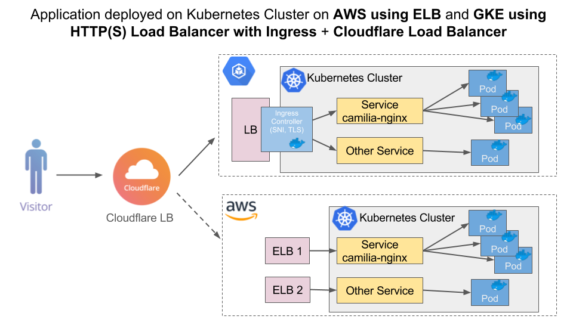
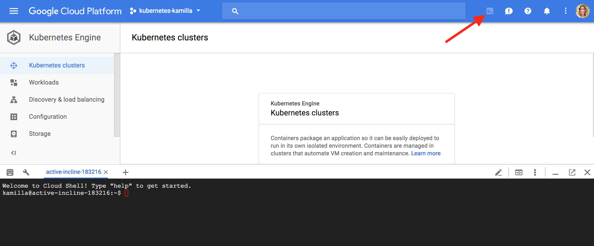

# Deploy containerized applications

Cloudflare’s Load Balancer distributes global traffic intelligently across Google Kubernetes Engine (GKE) and Amazon Web Services EC2 (AWS). Cloudflare’s native Kubernetes support provides a multi-cloud deployment that is transparent to end users.

## Prerequisites

Before you begin, be sure you have the following:

- Access to Google Cloud Platform (GCP)
- Access to AWS
- Docker image
- A domain on Cloudflare (on the Free, Pro, or Business plan) with a Load Balancing subscription, configurable in **Traffic** on the dashboard

## Deploying a containerized web application on Google Kubernetes Engine

You will be using [Google Cloud Shell](https://cloud.google.com/shell/) interface, which comes preinstalled with the gcloud console, docker, and kubectl command-line tools used below. If you use Cloud Shell, you do not need to install these command-line tools on your workstation.

### Getting started

Go to the [Kubernetes Engine](https://console.cloud.google.com/kubernetes?_ga=2.151836153.-1932148812.1510627946). Click the **Activate Google Cloud Shell** button at the top of the console window. A Cloud Shell session with a command prompt will open in a new frame at the bottom of the console.

Set default configuration values by running the following commands:

- `gcloud config set project PROJECT_ID`
- `gcloud config set compute/zone us-west1-a`

## Deploying a web application

1. Create a container cluster to run the container image. A cluster consists of a pool of Compute Engine VM instances running Kubernetes.

   - Run the following command to create a three-node cluster (our cluster name is _camilia-cluster_): `gcloud container clusters create camilia-cluster --num-nodes=3`

   - It may take several minutes for the cluster to be created. Once the command is complete, run the following command to see the cluster’s three worker VM instances: `gcloud compute instances list`

1. Deploy the application to the cluster. Use the kubectl command-line tool to deploy and manage applications on a Kubernetes Engine cluster.
   You can create a simple nginx docker container, for example, using the following command (_camilia-nginx_ is the name for the deployment):
   `kubectl run camilia-nginx --image=nginx --port 80`
