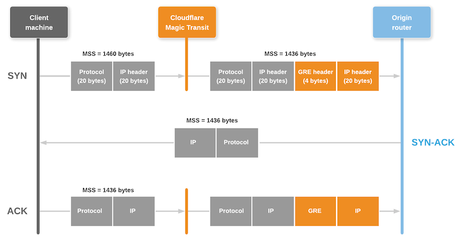

# Requirements

Before you can begin using Magic WAN, verify that you meet Cloudflare's onboarding requirements.

## Use compatible tunnel endpoint routers

Magic WAN relies on Generic Routing Encapsulation (GRE) tunnels to transmit packets from Cloudflare’s edge to your origin network. To ensure compatibility with Magic WAN, the routers at your GRE tunnel endpoints must:

- Support GRE tunneling
- Allow configuration of at least one tunnel per Internet service provider (ISP)
- Support maximum segment size (MSS) clamping

## Set maximum segment size



The SYN-ACK packet sent to the client during TCP handshake encodes the value for maximum segment size (MSS). Egress packets are routed via your ISP interface, and each packet must comply with the standard Internet routable maximum transmission unit (MTU), which is 1500 bytes.

Cloudflare uses GRE tunnels to deliver packets from our edge to your locations, while Cloudflare Magic WAN encapsulates these packets, adding a new IP header and GRE protocol header.

To accommodate the additional header data, **you must set the MSS value to 1436 bytes at your physical egress interfaces** (not the GRE tunnel interfaces):

<table>
  <thead>
    <tr>
      <th></th>
      <th>Standard Internet routable MTU</th>
      <th align="right">1500 bytes</th>
    </tr>
  </thead>
  <tbody>
    <tr>
      <td>&#45;</td>
      <td>Original IP header</td>
      <td align="right">20 bytes</td>
    </tr>
    <tr>
      <td>&#45;</td>
      <td>Original protocol header (TCP)</td>
      <td align="right">20 bytes</td>
    </tr>
    <tr>
      <td>&#45;</td>
      <td>New IP header</td>
      <td align="right">20 bytes</td>
    </tr>
    <tr>
      <td>&#45;</td>
      <td>New protocol header (GRE)</td>
      <td align="right">4 bytes</td>
    </tr>
    <tr>
      <td>&#61;</td>
      <td>Maximum segment size (MSS)</td>
      <td align="right">1436 bytes</td>
    </tr>
  </tbody>
</table>

Unless you apply these MSS settings at the origin, client machines do not know that they must use an MSS of 1436 bytes when sending packets to your origin.

### Follow router vendor guidelines

Instructions to adjust MSS by applying MSS clamps vary depending on the vendor of your router.

The table lists several commonly used router vendors with links to MSS clamping instructions:

| Router device | URL                                                                                                                                                                                   |
| ------------- | ------------------------------------------------------------------------------------------------------------------------------------------------------------------------------------- |
| Cisco         | [TC IP Adjust MSS](https://www.cisco.com/en/US/docs/ios-xml/ios/ipapp/command/ip_tcp_adjust-mss_through_ip_wccp_web-cache_accelerated.html#GUID-68044D35-A53E-42C1-A7AB-9236333DA8C4) |
| Juniper       | [TCP MSS – Edit System](https://www.juniper.net/documentation/en_US/junos/topics/reference/configuration-statement/tcp-mss-edit-system.html)                                          |

### Verify MSS settings at your origin

To verify that your routers have the correct MSS setting (1436 bytes) at your origin, run the following command on the servers egressing the prefixes you want to add to Magic WAN:

```sh
$ curl 167.71.125.57:8080
```

You should see the following result:

```txt
Local: 167.71.125.57:8080
Remote: 172.68.141.62:44108
Local MSS: 1436
Remote MSS: 1436
```

<bongo:aside type='warning' header='Important'>

If you do not have a publicly available TCP endpoint that Cloudflare can use to verify your MSS settings, you must provide a screenshot of the cURL command results, similar to the example above.

</bongo:aside>
