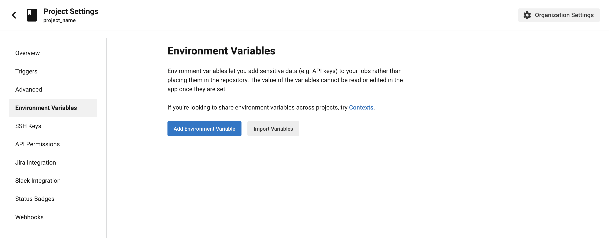

 
# Use Direct Upload with continuous integration
 
Cloudflare Pages now supports directly uploading pre-built assets, allowing you to use custom build steps for your applications and deploy to Pages with [Wrangler](/workers/wrangler/).
 
 
## Deploying with Wrangler
 
In your project directory, install [Wrangler](/workers/wrangler/) so you can deploy a folder of prebuilt assets by running this command:
 
```sh
# Publish created project
CF_ACCOUNT_ID=<account id> npx wrangler pages publish <directory> --project-name=<project name>
```
 
 
## Generate API Token from Cloudflare.
 
First log  into the [Cloudflare dashboard](https://dash.cloudflare.com/profile/api-tokens) >  **My Profile** > **API Tokens** > **Create Token** and under "Create Custom Token", select **Get started**. Start by naming the API Token, specify what product you are creating the API token for and give it the edit permission. In this case, select the "Account", "Cloudflare Pages" and "Edit":
 

 
Click on **Continue to summary** and then **Create Token**. Now that you have created this token, you can use it to push your project from continuous integration platforms.
 
## Using GitHub Actions
 
[GitHub Actions](https://docs.github.com/en/actions) is a continuous integration and continuous delivery (CI/CD) platform that allows you to automate your build, test, and deployment pipeline when using GitHub. You can create workflows that build and test every pull request to your repository or deploy merged pull requests to production.
 
After initially setting up your project, you can set up a GitHub Action to automate your subsequent deployments with Wrangler.
 
### Add Cloudflare credentials to GitHub secrets
 
In the GitHub action you have set up, environment variables are needed to push your project up to Cloudflare Pages. Add the values of these environment variables in your project's GitHub repository by going to your projects repository > **Settings** > **Secrets** > **Actions** > **New repository secret**.
 
Add the value of your CLOUDFLARE_ACCOUNT_ID and CLOUDFLARE_API_TOKEN; As `CF_ACCOUNT_ID` and `CF_API_TOKEN`, this will ensure that these secrets are secure, and each time your Action runs, it will access these secrets.
 
### Setup workflow
 
Create a `.github/workflows/pages-deployment.yaml` file at the root of your project. This file will contain the commands you want the process to take on the request you specified. For a detailed explanation of GitHub Actions syntax, refer to the [official documentation](https://docs.github.com/en/actions).
 
In your `pages-deployment.yaml` file, copy the following content:
 
```yaml
---
filename: .github/workflows/pages-deployment.yaml
—--
on: [push]
jobs:
 deploy:
   runs-on: ubuntu-latest
   name: Deploy to Pages
   steps:
     - uses: actions/checkout@v3
     - name: Publish
       uses: cloudflare/wrangler-action@2.0.0
       with:
         apiToken: ${{ secrets.CF_API_TOKEN }}
         accountId: ${{ secrets.CF_ACCOUNT_ID }}
         command: pages publish --project-name=<project name>
 
```
 
In the above code block, you have set up an Action that runs when you push code to the repository; running on `ubuntu-latest`, it first checks out your repository with the latest version of Node.
 

 
If your project uses a different Node version less than 16, you will have to upgrade your Node version as Wrangler requires at least Node.js v16.7.0.
 

 
The next step is to install [Wrangler 2](/workers/wrangler/) in your project, using the `cloudflare/wrangler-action@2.0.0` action which requires you to have set up your environment variables.
 
Finally, the Action makes sure you log in to your Account with your Cloudflare credentials stored as secrets in your project to publish your site with the `pages publish` command.
 
 
## Using CircleCI for CI/CD
 
[CircleCI](https://circleci.com/) is another continuous integration and continuous delivery (CI/CD) platform that allows you to automate your build, test, and deployment pipeline. It can be configured to run very complex pipelines efficiently with caching, docker layer caching, resource classes, etc.
 
Similar to GitHub Actions, CircleCI can use Wrangler to continuously deploy your projects each time to push to your code.
 
### Add Cloudflare credentials to CircleCI
 
After you have generated your Cloudflare API token and found your account ID in the dashboard, you will need to add them to your CircleCI dashboard so your environment variables can be used in your project.
 
On the CircleCI web app, go to your project's settings. You can navigate to "Projects" on the side navigation and then click the ellipsis button in the project's row. You will see the option to add Environment variables:
 

 
Then click on **Environment Variables** in the side navigation > **Add variable** and enter the name and value of the new environment variable, which in this case is your Cloudflare credentials (`CLOUDFLARE_ACCOUNT_ID` and `CLOUDFLARE_API_TOKEN`).  
 
### Setup
 
Create a `.circleci/config.yml` file at the root of your project. This file contains the jobs that will be executed based on the order of your workflow. In your `config.yml` file, copy the following content:
 
```yaml
---
filename: .circleci/config.yml
---
version: 2.1
jobs:
 Publish-to-Pages:
   docker:
     - image: cimg/node:17.2.0
   steps:
     - checkout
     # Run your project's build step
     - run: npm install && npm run build
     # Publish with wrangler
     - run: npx wrangler pages publish dist --project-name=<PROJECT NAME> # Replace dist with the name of your build folder and input your project name 
       environment:
        CLOUDFLARE_ACCOUNT_ID: $CLOUDFLARE_ACCOUNT_ID
        CLOUDFLARE_API_TOKEN: $CLOUDFLARE_API_TOKEN
   
workflows:
 Publish-to-Pages-workflow:
   jobs:
     - Publish-to-Pages
 
 
```
 
Your continuous integration workflow is broken down into Jobs when using CircleCI. From the code block above, you can see that you first define a list of jobs that run on each commit. For example, your repository will run on a prebuilt docker image `cimg/node:16.7.0`. It first checks out the repository with the Node version specified in the image.
 

 
If your project uses a different Node version less than 16, you will have to upgrade your Node version as Wrangler requires at least Node.js v16.7.0.
 

 
The job then proceeds to run all the steps specified, after which you will need to define a `workflow` at the end of your file. You can learn more about creating a custom process with CircleCI from the [official documentation](https://circleci.com/docs/2.0/concepts/).
 
 
 
## Using Travis CI for CI/CD
 
Travis CI is an open-source continuous integration tool that handles specific tasks; such as Pull requests, and code pushes for your project workflow. Travis can be integrated into your GitHub projects, databases and other pre-installed services which can be enabled in your build configuration.  To use Travis CI you should have A GitHub or Bitbucket or GitLab or Assembla account.

### Add Cloudflare credentials to TravisCI
 In your Travis project you will need to add the Cloudflare credentials you have generated from the Cloudflare dashboard in order to access them in your `travis.yml` file. To do this head over to your Travis CI dashboard and select your current project > More options > settings > Environment variables.

Set the name and value of the Environment variable and also the branch you want it to be attached to. You can also set the privacy of the value.

### Setup
Go to Travis-ci.com and enable your repository by login in with your preferred provider. This guide uses GitHub. Next create a `.travis.yml` file and copy the following into the file:

```yml
language: node_js
node_js:
- "16.17.0" # You can specific more versions of node you want your CI process to support
branches:
 only:
   - travis-ci-test # Specify what branch you want your CI process to run on
install:
 - npm install
 
script:
 - npm run build # Switch this out with your own build command or remove if     you don't have a build step
 - npx wrangler pages publish dist --project-name=<PROJECT NAME>
 
env:
- CLOUDFLARE_ACCOUNT_ID: {$CLOUDFLARE_ACCOUNT_ID}
- CLOUDFLARE_API_TOKEN: {$CLOUDFLARE_API_TOKEN}
 

```

In the code block above you have specified the language as `node_js` and listed the value as `16.7.0` because wrangler2 depends on this version of node or higher. You have also specified branches you want you continuous integration to run on. In the script section, input your `PROJECT NAME` and your CI process should work as expected. 
 
 
 

