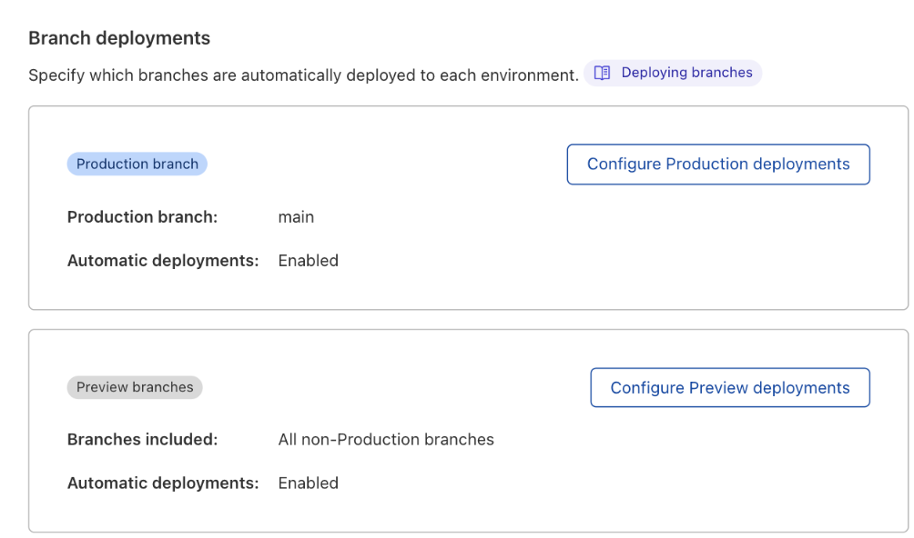
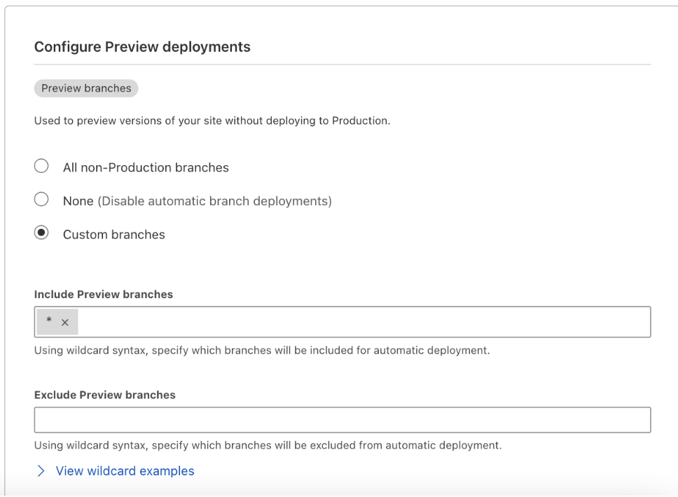

## Branch Build Controls 

When connected to your git source, Pages allows you to control which environments and branches you’d like to automatically build. By default, any time you commit to either your Production or Preview environment Pages will trigger a build. However, with branch build controls, you can configure automatic deployments to suit your preference on a per project basis.

### Skip Builds 

Without any configuration required, you can choose to skip a build and deployment on an adhoc basis. By adding [CISkip], [CI-Skip], [Skip CI], [Skip-CI] or [CF-Pages-Skip] as a prefix in your commit message, Pages will omit that build/deployment. The prefixes are case insensitive. 

However, if you would like to configure your project’s settings for automatic deployments going forward without having to use CI Skip, begin by navigating to the **Build & Deployments **section of your project. 

### Production branch control 

Select  “Configure Production deployments”. Pages will default to setting your Production environment to the branch you first push, however, you can set your production to another branch if you choose. 

You can also enable or disable automatic deployment** **behavior on the Production branch by checking the provided box. You must save your settings in order for the new Production branch controls to take effect. 

### Preview branch control 

To configure automatic builds for preview deployments, there are three options to choose from. 

* **All non-Production branches**: By default, Pages will automatically deploy any and every commit to a Preview branch and thus is set to “All non-Production branches”. 
* **None**: If you would like to turn off automatic builds for all preview branches you can do so by selecting this option. 
* **Custom branches** :However, if you would like to further customize the automatic deployments of _certain_ preview branches, you can do so by selecting **Custom Branches** &lt;custom branch configure link>

#### Custom Preview Branch Control  

By selecting “Custom branches”, you can specify in the provided configuration fields branches you wish to include and exclude from automatic deployments. The configuration fields can be filled in two ways: 

* **Static branch names**: Enter the precise name of the branch you are looking to include or exclude (e.g. staging, dev) 
* **Wildcard syntax: **Use wildcards to match multiple branches. You can specify wildcards at the start or end of your rule. The order of execution for the config is:
1. Excludes
2. Includes
3. Skip 

This means we will process the exclude configuration first, then go to the include configuration and if a branch doesn't match either then it will be skipped.

##### Wildcards

A wildcard (`*`) is a character that is used within rules. It can be placed alone to match anything or placed at the start or end of a rule to allow for better control over branch configuration. A wildcard will match zero or more characters. 

For example, if you wanted to match all branches that started with `fix/` then you would create the rule `fix/*` to match strings like `fix/1`, `fix/bugs`or `fix/`

###### Example 1: 

If you want to enforce branch prefixes such as `fix/`, `feat/`, or `chore/` with wildcard syntax, you can include and exclude certain branches with the following rules:

**Include Preview branches:**

`fix/*`, `feat/*`, `chore/*`

**Exclude Preview branches:**

``

where Pages will include any branches with the indicated prefixes and exclude everything else.

###### Example 2

If you wanted to prevent dependabot from creating a deployment for each PR it creates, you can exclude those branches with the following:

**Include Preview branches:**

`*`

**Exclude Preview branches:**

`dependabot/*`

where Pages will include all branches except any branch starting with “dependabot”. 

###### Example 3: 

If you only want to deploy release-prefixed branches, then you could use the following rules:

**Include Preview branches**

`release/*`

**Exclude Preview branches**

`*`

This will deploy only branches starting with `release/`.