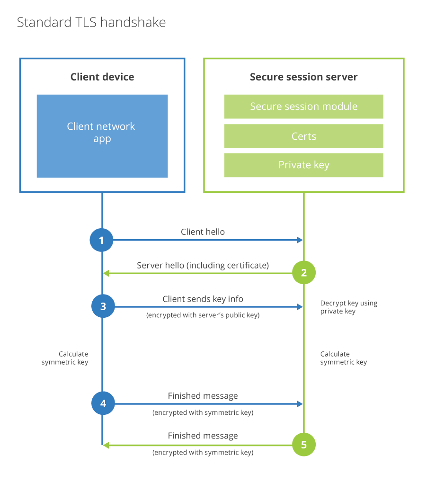
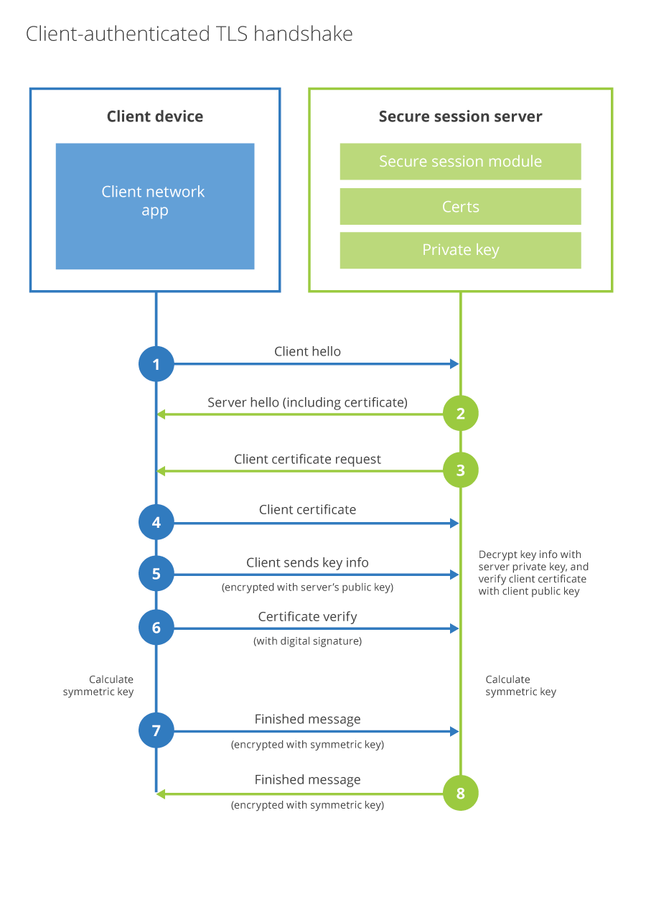

# How authenticated origin pulls work

## Simple explanation

When visitors request content from your domain, Cloudflare first attempts to serve content from the cache. Failing that, Cloudflare sends a request — or an `origin pull` — back to your origin web server to get the content.

Authenticated origin pulls make sure that all of these `origin pulls` come from Cloudflare. Put another way, authenticated origin pulls ensure that any HTTPS requests outside of Cloudflare will not receive a response from your origin.

<bongo:aside type='note' header='Note'>

Requests to gray-clouded records within Cloudflare DNS are also blocked.

</bongo:aside>

## Detailed explanation

Cloudflare enforces authenticated origin pulls by adding an extra layer of TLS client certificate authentication when connecting between Cloudflare and the origin web server.

**Standard TLS handshake**

**TLS handshake with authenticated origin pulls**

