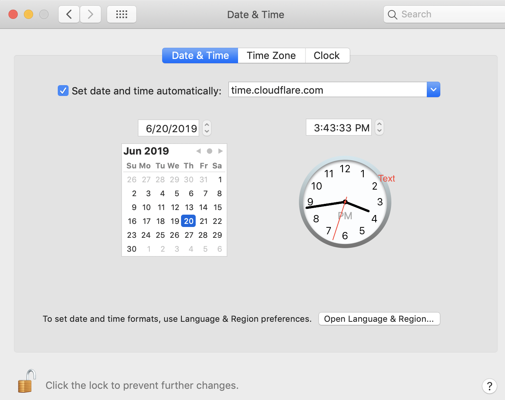
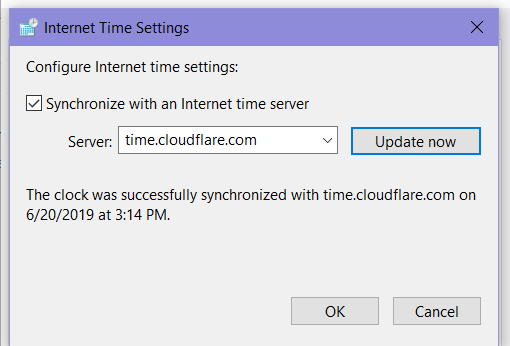
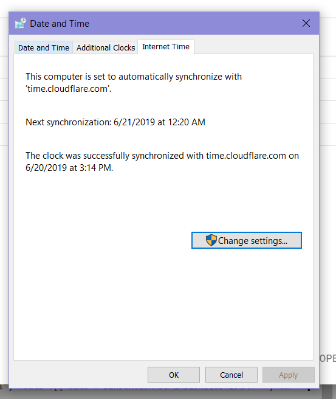

# Using Cloudflare's Time Service

Cloudflare offers a free public time service that allows you to use our anycast network of 180+ locations to synchronize time from our closest server. To use our NTP server, change the time configuration in your device to point to `time.cloudflare.com`.

We do not implement leap smearing: NTP includes a Leap Indicator field [spec](https://tools.ietf.org/html/rfc5905#section-7.3) and the kernel will apply the leap second correction at the appropriate time. This is the behavior servers
in pool.ntp.org share. Using servers that smear time along with servers that do not may lead to unpredictable and anomalous results.

Here is an example of how to configure your Mac to synchronize time from time.cloudflare.com:

1. Go to System Preferences
2. Go to Date & Time
3. Click the lock icon on the bottom left to make changes
4. Enter your password
5. Next to Set date and time automatically, enter `time.cloudflare.com`

... and you're all set!

Here is an example of how to configure your Windows computer to synchronize time from time.cloudflare.com:

1. Go to Control Panel
2. Go to Clock and Region
3. Click on Date and Time
4. Go to the Internet Time tab
5. Click Change settings..
6. Next to Server:, type `time.cloudflare.com` and click 'Update now'
7. Click 'OK'

You should receive the following message, letting you know that you have successfully synchronized your time.

